# Terminology
- ABI: [Application Binary Interface](https://en.wikipedia.org/wiki/Application_binary_interface), low-level interface on the byte layer

# Preamble
A few months ago, I received a new toy: a big 80x7 pixel LED matrix. Seeing as I previously controlled WS2812B LED strips and some smaller matrizes using an Arduino, I was really hyped and optimistic that I could get it to work relatively fast and without any complications.
Oh, how naive I was...

Fast forward to the present and, well, this project has exploded in complexity.

But, how did we get here?

# How it started
So, let's get to work then, shall we?

The only model indicator on the matrix was a weird sticker.
Let's just search up this model and... *oh. No results.*
Googling the company, WipaMedia, revealed that they mainly produce LED displays for other companies, or in other terms: B2B.

This made my work harder as, after some more research, I concluded that this particular model is a custom one and (probably) one of the only ones on this globe. Nice.

Well, how do I control this thing then?
Taking a closer look at the hardware, there was a port that I later identified to be a RS232 connector. Seeing as I had zero clue on how to power the matrix, let alone programming it, I gave up for the time being.

## Renaissance
In December of 2023, the Christmas break started. On the 28th, I was kinda bored and figured I'd give the matrix another go.
Excited, my dad and I got to work on powering it and, soon enough, we got it to display a little demo!

With that, the first step was done. Now, to get to the fun part: actually programming it.

After some searching, I managed to get a hold of an old Windows-only program with zero documentation: "Moving-sign V3.48".
I figured I'd give it a shot and connected the matrix to a test laptop I quickly set up for this use case.

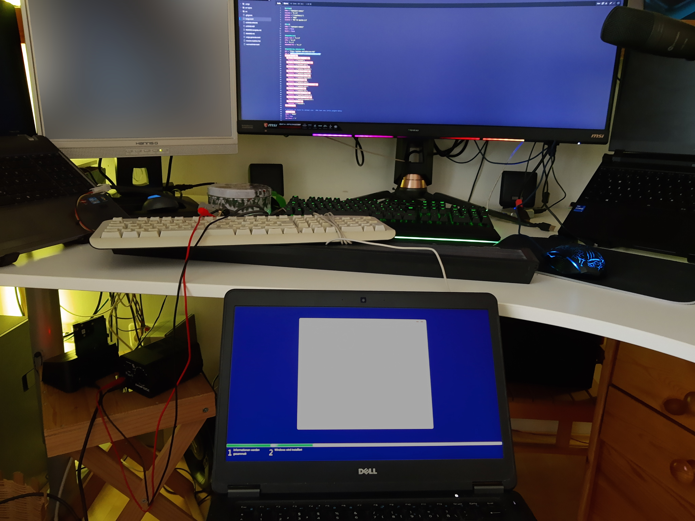

Launching the program, I was confrontend with this:
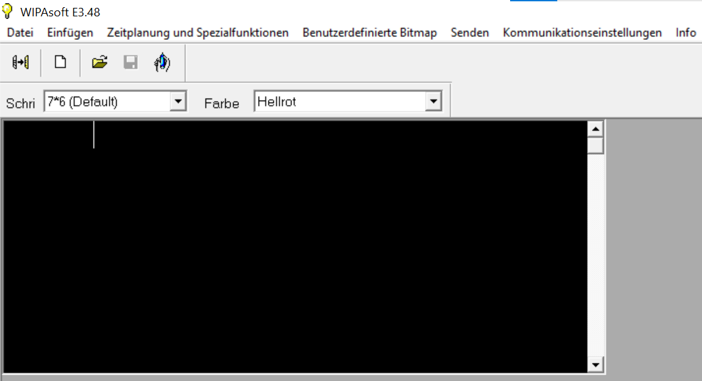
So I did what I do best: randomly clicking around menus to get an overview of the capabilities and options.

Before long, I found a menu to configure devices. In the creation menu, there were two options. One was the COM-Port, which was easy to find, as there was only one entry.
The other option to set was the baud rate. We figured it to be the number displayed upon powerup and set it to 2400.

However, that was not the only thing to configure.
In order to send data, I had to create a "location", choose the previously created device and set the matrix address (read: "index", to daisy chain em), which was also printed on startup.

Now, I just typed in some text, hit send and.. IT WORKS!!


# F*ck proprietary windows app, all my homies write their own software
*Now that's a long title... But it perfectly describes what I did next!*

Since I didn't want to continue using this weird pre-historic Windows-only software, I figured I'd find out how it works and program my own version.
In an ideal world, I'd want to control the matrix with my PC, Phone and a car radio (based on Android or using Android Auto) alike.

To do this, I first had to figure out how to program the matrix in the first place.

## So how does this thing work?
Since all communication takes place over the COM port, I figured I'd get myself a sniffer and try to scoop up the communication.
This was easier said than done though. After having tried multiple tools, I finally found one that worked: [ENLYZE's Port Sniffer](https://github.com/enlyze/PortSniffer).

Unfortunately, this is still Windows after all and, accordingly, I had to disable some of the "safeguards" microshit implemented.
In practice, this means that every time I want to use the program I have to
1. restart Windows into advanced mode
2. click Troubleshoot -> Startup Settings
3. click "restart" and let it boot into the startup settings menu
4. hit `7` to disable driver signature enforcement
5. let it reboot.. *again*

Phew, that was already tedious enough but, believe it or not, that's not even it with the Windows troubles :) \
Running the port sniffer exe from the command line opened an administrator prompt. Fair enough, yes please, do as you wish. \
Boom. A new console window opens (the sniffer is a CLI tool) and closes IMMEDIATELY. Awesome!

<video controls style="width: 100%">
    <source src="./images/sniffer-autoclose.mp4" type="video/mp4"/>
</video>

After some asking around, I found out that you had to start the EXECUTING cmd window as an administrator. Now, running the exe doesn't spawn a new window and, hence, you can read the output just fine.

## \*Sniff, Sniff\*
With these last troubles ironed out, it was finally time to `PortSniffer-Tool.exe /monitor COM4 W`.
This allowed me to read what the software was sending. Now, are you ready for a "Hello World"?
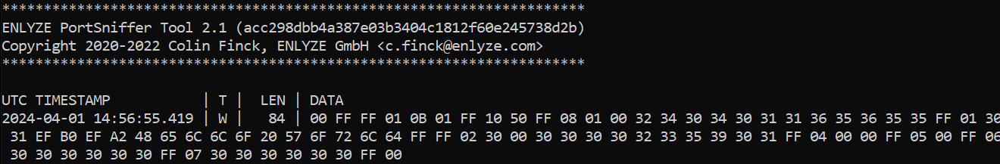

Damn. That's a *lot* for just a few characters...
```
00 FF FF 01 0B 01 FF 10 50 FF 08 01 00 32 34 30 34 30 31 31 36 35 36 35 35 FF 01 30 31 EF B0 EF A2 48 65 6C 6C 6F 20 57 6F 72 6C 64 FF FF 02 30 00 30 30 30 30 32 33 35 39 30 31 FF 04 00 00 FF 05 00 FF 06 30 30 30 30 30 30 FF 07 30 30 30 30 30 30 FF 00
```

Hm, now that's... hard to read... Let's make it a bit prettier :)

One [quick bash script](https://github.com/SIMULATAN/matrixcontrol/blob/main/protocol/create-table.sh) later and we're left with this table:

| 00 | FF | FF | 01 | 0B | 01 | FF | 10 | 50 | FF | 08 | 01 | 00 | 32 | 34 | 30 | 34 | 30 | 31 | 31 | 36 | 35 | 36 | 35 | 35 | FF | 01 | 30 | 31 | EF | B0 | EF | A2 | 48 | 65 | 6C | 6C | 6F | 20 | 57 | 6F | 72 | 6C | 64 | FF | FF | 02 | 30 | 00 | 30 | 30 | 30 | 30 | 32 | 33 | 35 | 39 | 30 | 31 | FF | 04 | 00 | 00 | FF | 05 | 00 | FF | 06 | 30 | 30 | 30 | 30 | 30 | 30 | FF | 07 | 30 | 30 | 30 | 30 | 30 | 30 | FF | 00 |
|----|----|----|----|----|----|----|----|----|----|----|----|----|----|----|----|----|----|----|----|----|----|----|----|----|----|----|----|----|----|----|----|----|----|----|----|----|----|----|----|----|----|----|----|----|----|----|----|----|----|----|----|----|----|----|----|----|----|----|----|----|----|----|----|----|----|----|----|----|----|----|----|----|----|----|----|----|----|----|----|----|----|----|----|
|    |    |    |    |    |    |    |    |  P |    |    |    |    |  2 |  4 |  0 |  4 |  0 |  1 |  1 |  6 |  5 |  6 |  5 |  5 |    |    |  0 |  1 |    |    |    |    |  H |  e |  l |  l |  o |    |  W |  o |  r |  l |  d |    |    |    |  0 |    |  0 |  0 |  0 |  0 |  2 |  3 |  5 |  9 |  0 |  1 |    |    |    |    |    |    |    |    |    |  0 |  0 |  0 |  0 |  0 |  0 |    |    |  0 |  0 |  0 |  0 |  0 |  0 |    |    |

*feel free to scroll further to the right to see the juicy ~~bits~~ bytes*

# Reverse Engineering the protocol
Now that I had a reliable way to test and visualize messages, it was time to test sending without the software.

Since I wanted the protocol to be available on multiple platforms, I decided to use Kotlin Multiplatform.

Well, I quickly threw together some Kotlin code to send bytes to a serial port.
Since I had big ambitions for this project, also in terms of different means to control the matrix, I organized the different components into Gradle subprojects right from the start.
This helped me to decouple the system and re-use parts in a mix-and-match fashion.

First, I simply tried to send the sniffed bytes 1:1 to the matrix and it actually worked on the first attempt!

This marked the first successful write without any proprietary shitware.

## Let's implement arbitrary text
The logical next step was to let the user decide what to send.

As such, I created what would eventually become the [MatrixCLI](https://github.com/SIMULATAN/matrixcontrol/blob/main/cli/src/main/kotlin/com/github/simulatan/matrixcontrol/cli/MatrixCLI.kt).
At the same time, I began work on the core of it all: the [protocol](https://github.com/SIMULATAN/matrixcontrol/tree/main/protocol).

What started as just concating `prefix + <user defined message> + suffix` went on to become more and more dynamic as I understood more and more parts of the protocol.

With the base work in place, I could finally start getting to the gritty details. I tried to send different variations, adding transitions, using multiple lines, you name it.
Then, I compared the different variations - "What's the difference between text with and without a transition?"

By doing this, I managed to figure out more and more details.

### Transitions
I started with the most fun functionality: Transitions. It turned out that those have to be set *before* the line to animate in the software.
In bytes, this translates to:
| Transition | Start of line | Text             |
|------------|---------------|------------------|
| `01`       | `EF B0 EF A2` | `46 69 72 73 74` |

The single transition byte seemed difficult to figure out at first but, after having tried multiple ones, I found a fun detail: they are literally just the decimal equivalents of 1 to 25!
And the best of all: the ones in the UI are correctly sorted!

With that information, I created [an enum](https://github.com/SIMULATAN/matrixcontrol/blob/main/protocol/src/commonMain/kotlin/com/github/simulatan/matrixcontrol/protocol/message/parts/TransitionMessagePart.kt) with the transitions in the right order and just converted `ordinal + 1` to the corresponding hex to use transitions!

### "Boilerplate"
Apart from my `MessagePart`s, I also reverse-engineered some of the "boilerplate". For example, the keen eye might have noticed a timestamp being encoded into every ABI message.
Although I haven't figured out the exact reason just yet, I'd assume it to be somehow related to the date display features. It probably keeps an internal clock, the time of which is synced occasionally from the ABI clients.

Well, that's about it with the current functionality. Newlines, plain text and transitions.


# Designing the API
Seeing as I haven't created a high-level API for an ABI yet, I first had to come up with a good and user-friendly concept in order to turn this newfound knowledge into user-friendly APIs.
Kotlin, unlike Java, also supports unsigned bytes. Although signed bytes are used in-transit, unsigned bytes are prettier to look at and more accurate to the formatted hex strings.

Since it seemed as if most of the dynamic part could be handled by "just" concating bytes together, I opted for this approach:
a `MessagePart` interface with just a single function `toByteArray`. This allowed me to gradually introduce more parts (Transitions, Newlines, speed, ...)
and represented the original UI quite well.

For example, the aforementioned enum can be implemented like this:
```kt
enum class TransitionMessagePart : MessagePart {
    ZYKLISCH,
    STILLSTEHEND
    // ...

    override fun toByteArray(): UByteArray {
       // transitions are the decimal values 1-25, represented as one byte
       return ubyteArrayOf((ordinal + 1).toUByte())
    }
}
```

Now, I created a `MessageBuilder`. It stores a list of `MessagePart` and has a function to create the final bytes to send.

While the beginnings where humble, the builder function soon turned into an absolute nightmare. Why? Well....

## Newlines...
Think about this for a second: if you had to implement a multi-line protocol, how would you tell the matrix to start a new line.

Just `\n`, like any sane person would do, right..? Well... the WipaMedia developers came up with a special little idea...

A start of line is this: `EF B0 EF A2`. This isn't enough to make a new line though. Instead, you have to prepend lines with `EF B1 EF A0`, as a sort-of `\n` equivalent.
Transitions have to be specified *before* the start of line sequence.
Between every `Newline` and `Start of line`, there's a single `FF` byte. In my code, this is called the `Message Terminator`. However, if a transition is present, it has to be inserted *between* `FF` and `Start of line`.
The last line has no `Newline` at the end.

These things were incredibly frustrating to find out and I teared my hair out a few times in the process 😅

For future reference, I noted all my learnings and the different messages down in the
[PROTOCOL.md](https://github.com/SIMULATAN/matrixcontrol/blob/main/protocol/PROTOCOL.md) file.

You can find the code in the [protocol module](https://github.com/SIMULATAN/matrixcontrol/tree/main/protocol/src/commonMain/kotlin/com/github/simulatan/matrixcontrol/protocol).
In particular, take a look at [MessageBuilder#build](https://github.com/SIMULATAN/matrixcontrol/blob/ffa1b1bb00ca17be121403db596de8862008d9cb/protocol/src/commonMain/kotlin/com/github/simulatan/matrixcontrol/protocol/message/MessageBuilder.kt#L47-L89) function to get a better understanding of why this took so long to come up with.

# Time to put the "Control" in "MatrixControl"
Now that the API is in place, it's time to create user-friendly clients.

As mentioned before, I wanted to create an Android app.

Since it was my first time doing app development, I first researched my options, ultimately settling on Kotlin Multiplatform with Jetpack Compose.

The app is divided into three sections (screenshots are [down below](#android-app)):
1. Settings
2. Control
3. Presets

First, for the settings. There's multiple communication options available.
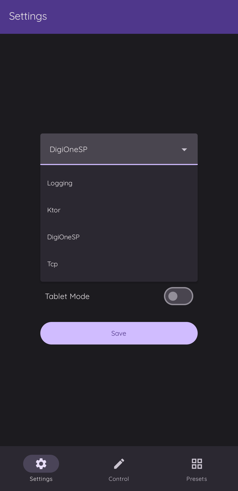
I created a lightweight [relay-server](https://github.com/SIMULATAN/matrixcontrol/tree/main/relay-server) - a simple Ktor application that relays bytes received over HTTP using an USB-to-RS232 adapter.
Although using a dedicated laptop as the relay worked well, it wasn't feasable for longer deployments. Thankfully, a little device called the ["DigiOne SP"](https://www.digi.com/products/networking/infrastructure-management/serial-connectivity/device-servers/digionesp) soon appeared.

## DigiOne SP
This handy toy is exactly what my relay server did: receive bytes over TCP, relay them to its built-in serial port. This, I believe, turned out to have a name: "Reverse Telnet".
So far, so good. In order to discover the correct connection parameters, the creators came up with a neat feature: UDP autodiscovery.
Unfortunately, proprietary closed-source protocols came to bit me again.

[Multiple](https://www.digi.com/resources/documentation/digidocs/90001537/references/r_advanced_device_discovery_prot.htm?TocPath=Categories%7CJava%7C_____1) [sources](https://www.digi.com/resources/documentation/digidocs/90001431-13/content/tasks/t_discover_devices.htm) pointed to some Java Library called "AddpClient". They even linked it: https://dl.bintray.com/digidotcom/maven/com/digi/addp/addplib/1.0/addplib-1.0.jar. \
..uh, small problem. JCenter doesn't exist anymore. The above link 404s. Sh*t.
Checking the trusty [mvnrepository](https://mvnrepository.com) resulted in [a single release](https://mvnrepository.com/artifact/com.digi.addp/addplib). It can be downloaded from... the Spring repository. Well, "can".. [Spring privated that repository in 2021](https://spring.io/blog/2020/10/29/notice-of-permissions-changes-to-repo-spring-io-fall-and-winter-2020). Another dead end. Where could I possibly find this jar??

I ended up connecting to some cryptic FTP with what seemed like a gazillion files. After what felt like exfiltrating classified documents from a hacked internal FTP server, I finally found the JAR, packaged as a ZIP, here: `ftp://ftp1.digi.com/support/utilities/AddpClient.zip`

Now that I had my client, auto discovery worked well enough and I built the `relay-provider-digionesp` module, which can be disabled by deleting the SPI `services` file, to the Android App.

# Wrapping Up
Well, that's the story of how I spent valuable hours of my lifetime "cracking the code" to some matrizes.

Later, I actually found 4 more devices (yes, 4!). Curiously, they were all very different (one was red, two had RJ45 ports, some had 5V, others 12V, ...), but thankfully, the protocol stayed the same 🙏
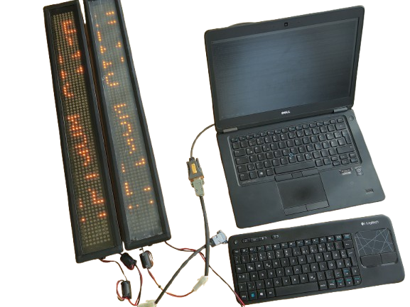
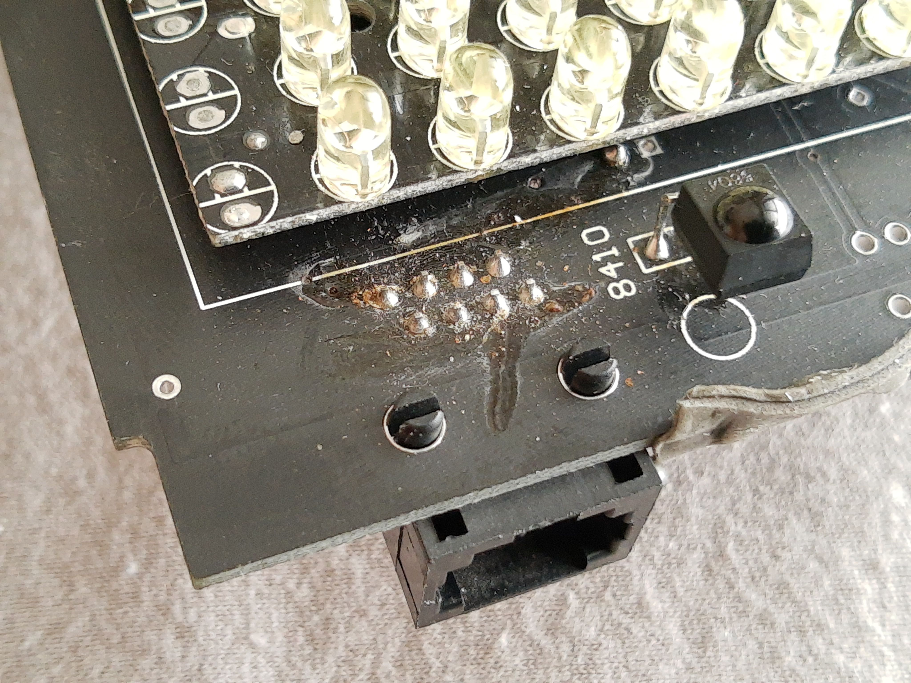

## Results
My work didn't go unnoticed, in fact, the hardware was used in several badass inventions.

## Android App
<div style="display: flex; justify-content: center;">
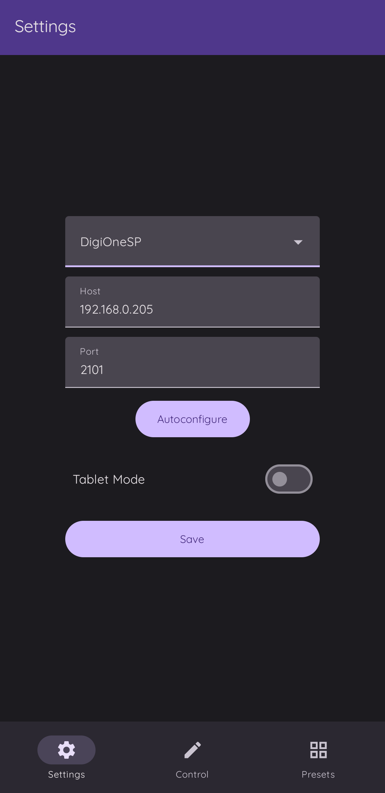
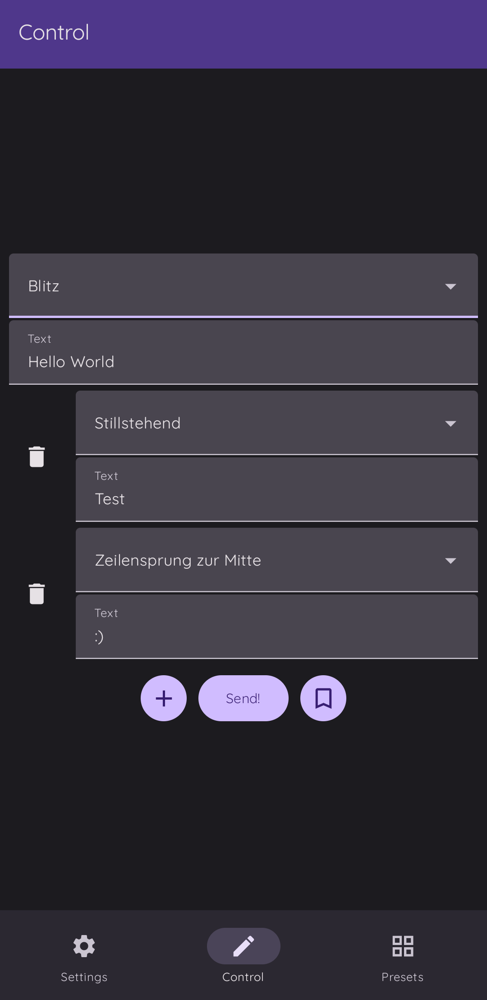
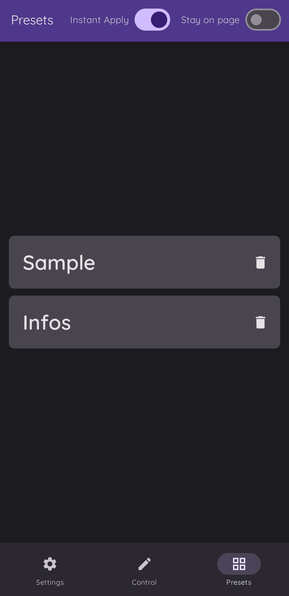
</div>
Considering this is my first ever Android App, I'm pretty proud of it!

## Portable Matrix
My dad and I built a portable Matrix running on a battery.
<div style="display: flex">

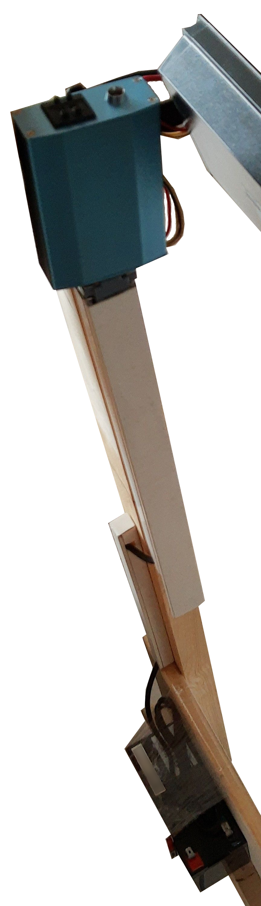
</div>

## Car
A friend of mine also developed a 3D-printed mount for his car.
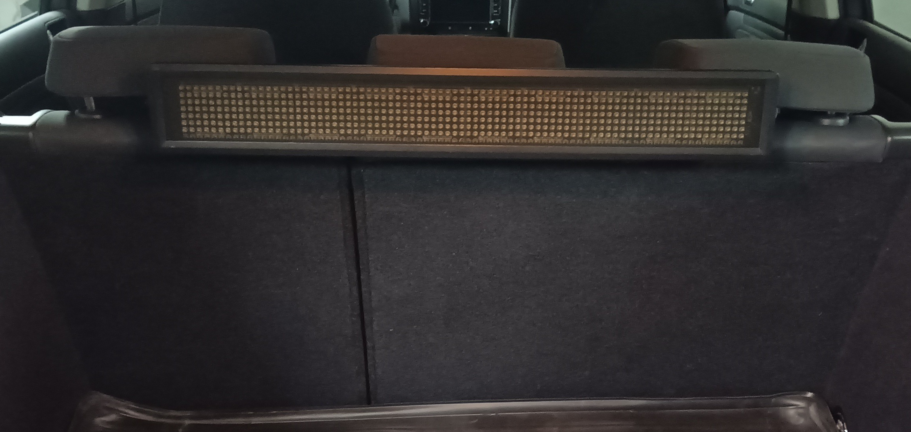

*sorry for the horrible camera quality*
